# The Lady Goldsmith
## **Code Institute - Portfolio Project 5: _E-commerce Application_** 
The Lady Goldsmith! is an online e-commerce fine jewellery store. This site was developed for my portfolio 5 project as part of the Code Institute - Full Stack Diploma in Software Development (ecommerce) course.
 <br>

## Demo

**View the Live Website [Here](https://ecommerce-pp5.herokuapp.com/)**

<br>


## Table of contents
+ [User Experience](#User-Experience)
     + [Project Goals](#Project-Goals)
     + [User Stories](#User-Stories)
     + [Strategy](#Strategy)
         + [Project Planning](#Project-planning)
         + [Web Marketing](#Web-Marketing)
            + [Facebook Campaign](#Facebook-Campaign)
            + [Newsletter Marketing Campaign](#Making-a-Local-Clone)
         + [SEO](#SEO)
         + [GDPR Considerations](#GDPR-Considerations)
     + [Scope](#Scope)
     + [Structure](#Structure)
          + [Front end Pages](Front-end-Pages)
     + [Skeleton](#Skeleton)
          + [Wireframes](#Wireframes)
     + [Surface](#Surface)
+ [Features](#Features) 
     + [Existing Features](#Existing-Features)
     + [Features to Implement in the future](#Features-to-Implement-in-the-future)
+ [Database](#Database)
+ [Technologies Used](#Technologies-Used)
     + [General Resources](#General-Resources)
     + [Tools](#Tools)
+ [Testing](#Testing) ☞ **[Testing.md](TESTING.md)**
+ [APIs and configuration](#APIs-and-configuration)
+ [Deployment](#Deployment)
     + [Heroku Deployment](#Heroku-Deployment)
     + [Forking the Repository](#Forking-the-Repository)     
     + [Making a Local Clone](#Making-a-Local-Clone)
+ [Credits](#Credits)

***
# User Experience
## Project Goals
The primary goal of The lady Goldsmith is to enable users to purchase jewellery through an fully functional, ecommerce website. The business model for the basis of this project is a Business to Consumer (B2C) model. The goal for the design was to make it as easy as possible to access information and make an online purchase, while striving for a minimalist and user-friendly layout. Furthermore, this application has been designed so that its contents can be adjusted quickly and adapt to new customer needs, without causing delays in service. This has been achieved through the use of both front and back-end CRUD functionality, for the administrator of the site.

## User Stories

**As an unregistered User, I want to:**

+ See that the navigation bar is displayed with a logo on all pages so I can easily find my way through the site.
+ Browse through all available products so I can select some items I wish to purchase.
+ Be able to view individual product details so I can identify the price, product description, rating and images.
+ Easily register an account so I can have a personal account and view my profile.
+ Receive email confirmation after registering so I can verify that my account registration was successful.
+ Be able to use the search option so I can search the site for specific keywords.
+ Be able to browse the Sale Items.
+ Be able to send a message to the business from the contact page.

**As an Registered User, I want to:**

+ Have the ability to log in to the site so I can access my personal details.
+ Easily recover my password if I forget it so I can regain access to my account information.
+ As a Shopper I want to have a personalized user profile so I can view my personal order history and save my payment information.
+ Add products to my Wishlist so I can keep track of the items I like the most for a future site visit.
+ View my bag and any items I currently have awaiting payment in my bag so I can avoid spending too much.
+ Be able to view items in my shopping bag to be purchased so I can identify the total cost of my purchase and all the items I will receive.
+ Easily enter my payment information so I can check-out quickly and with no issues.

**As an Administrative Account holder, I want to:**

+ Be able to log in to an admin panel so I can see all product/ order and users.
+ Be able to add, update or remove products so I can make changes without visiting the admin pane.
+ Receive email notifications when a user submits through the contact page so I can respond to the customers query in a timely manner.

<br>

[^ back to top ^](#Table-of-contents)

<br>

## Strategy
### — Project Planning —

 Agile development was implemented from the onset of this project and simply explained Agile is an iterative approach to project management and software development that helps teams deliver value to their customers, faster and with fewer headaches. Instead of betting everything on a "big bang" launch, an agile team delivers work in small, but consumable, increments. As the development team for this project was a single developer I attempted to use this approach for building this project.  
 <br>
 The methodology requires a detailed and thorough project planning process, to design and create a web-based interactive application. I distinguished the required functionality of the site and how it would answer the user stories, as described above, these user stories were then developed through the use of the Five Development Planes framework. To keep track of my development I created a user stories kanban board in github projects. I created an issue for each user story which was set to automatically display in my user story project. As I worked each user story, it was moved to the in progress column and finally into the completed column once it was complete.  
<br>
 The design of the website is meaningful and simple so that the purpose of the website is very clear for first-time users, and they can easily adapt to the website. This also applies to all the functions to create, post, edit and delete products for the Admin/site owners. The owner’s main goal is to provide a ecommerce platform that is easy to use whether they are first-time or returning users, which will in turn generate business sales. To achieve this, the website is designed and created by users first concept.

The functions on the tables below are minimum requirements for the website to achieve the current user's and owner's goals. On a scale of 1  - 5 

| Opportunity                                 | Importance | Viability / Feasibility |
| :------------------------------------------ | :--------: | :---------------------: |
| Register                                    |    5       |           5             |
| Login / Log out                             |    5       |           5             |
| Categories page                             |    5       |           5             |
| Search by Category                          |    5       |           5             |
| Create / Edit / Delete                      |    5       |           5             |
| Search Products By Keywords                 |    4       |           4             |
| Review By Other Users                       |    3       |           3             |
| Wishlist                                    |    4       |           4             |
| Responsiveness                              |    5       |           5             |
| Page 404                                    |    3       |           3             |
| Resetting Password When Users Forget It     |    5       |           5             |
| Contact us form                             |    5       |           5             |

Below are the additional functions that can improve the website, however, these are not mandatory to achieve the current user's and owner's goals. Some are not implemented due to a lack of my current skills & knowledge and also due to a lack of time allocated for this project.

| Opportunity                             | Importance | Viability / Feasibility |
| :-------------------------------------- | :--------: | :---------------------: |
| Currency selection                      |    4       |           2             |
| Shop our Instagram                      |    3       |           2             |
| Virtual Appointments                    |    2       |           1             |
| Delete Profile                          |    2       |           1             |
| Choose currency                         |    2       |           1             |

<br>

[^ back to top ^](#Table-of-contents)

<br>

### — Web Marketing —
<br>

#### **Facebook Campaign**
<br>

As Facebook is be a staple in any social media marketing strategy. A Facebook Business Page was created for my site and the facebook social link on the footer will bring a user directly here. 

<br>

**View the Live Website [Here](https://www.facebook.com/The-Lady-Goldsmith-106978708561394/?ref=pages_you_manage)**

<br>

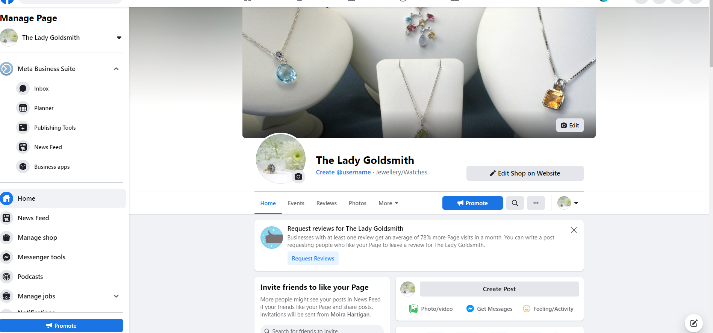

<br>

#### **Newsletter Marketing Campaign**

<br>

Mailchimp email marketing was used generate an email signup form for the footer. This free service allows the site owner to manage, run and analyse the success of their newsletter marketing campaign by following the simple steps on the mailchimp site to generate an email form.

<br>

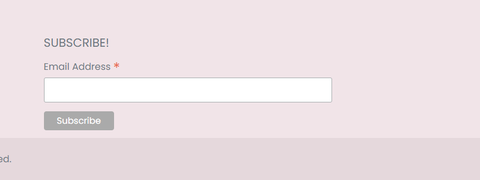

<br>

### — SEO —

In order to improve the sites search engine ranking two important files were added to the project :
- A sitemap.xml file 
This file was added to help speed up content discovery for search engines when they crawl and index the web applications.
- A robots.txt file
This fil was added to acknowledge that search engines are allowed on the site and that they may have free access to it.
A robots.txt file is a simple text file that tells search engines where they are not allowed  
to go on a website. It lists out any folders or files that will not be crawled or indexed by search engine spiders. 

In a real world situation a sitemap should be registered with Google in the Google Search console. However as payments are required for this it was not actioned for this project.

### — GDPR Considerations —

As this site is an ecommerce web application where payment information and other customer details will be collected, consideration to data protection law has been given on this project. A privacy policy was generated [here](https://www.privacypolicygenerator.info/) and a link to privacy policy created has been provided on the footer.
The purpose of this privacy policy is to inform site users about how their data is being collected and processed. 

<br>

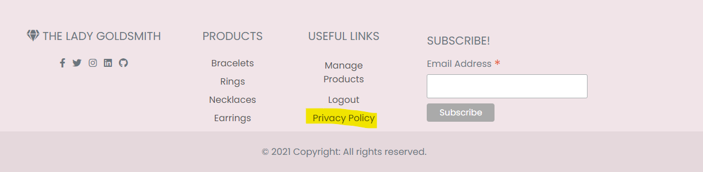

<br>

**View Privacy Policy [Here](https://www.privacypolicygenerator.info/live.php?token=BcTNhoYRILhUngJywBOyki3kdo9zluNl)**

<br>


## Scope

To achieve user and owner’s goals, above are the minimum features to be included in this project. Also, **CRUD** Create, Read, Update, and Delete functions are required for this project so these are implemented as a part of the essential features.

- Simple design Home page where first-time users can recognise the purpose of the website easily. 
- Register page where users can create an account.
- Login page where users can log in to the website
- Logout function that users can log out the website
- Profile page 
- Search 
- If a user encounters an error, the relevant error page is displayed (400, 403, 404 or 500)

<br>
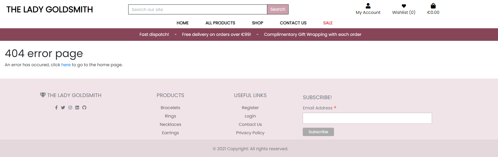
<br>

## Structure

### **— Front end pages —** 

The website consists of the following core pages:

- **Home** (`index.html`)<br>The landing page of the website. 
- **All Products** (`products.html`)<br> The page where users can view all the products available.
- **Product Detail** (`product_detail.html`)<br> The page where users can view each product description and additional information.
- **Add Product** (`add_product.html`)<br> The page were the site owner can add a new product to the site.
- **Edit Product** (`edit_product.html`)<br> The page where the site owner can edit the information on an existing product already on the site.
- **Sale** (`sale_items.html`)<br> The page where users can view all the sale items.
- **Contact Us** (`contact.html`)<br> The page were a user can send a message to the business.
- **Shopping Bag** (`bag.html`)<br> The page where the user can view items they have placed in their bag.
- **Checkout** (`checkout.html`)<br> The page where users can add their payment information.
- **Wishlist** (`wishlist.html`)<br> The page where users can see all their favourite items.
- **Profile** (`profile.html`)<br>The page where users will be led when they create an account or log in.
- **Register** (`account/signup.html`)<br>The page where users can create an account. Once a user creates an account successfully, they will be led to *Profile* page
- **Login** (`account/login.html`)<br>The page where users who have an account can log in to the website. Once users log in successfully, they will be led to *Profile* page. Again the navigation bar is different to *Home* page, and once a user is logged in, the *profile* page and *logout* page is now visible on the navbar.
**Note:**<br>
> Please note that login is **case sensitive** 

- **Error Pages** (`404.html`)(`403.html`)(`400.html`)(`500.html`)<br>These pages inform users, that the page they are looking for is not found and takes them back to *Home* page safely. 

<br>

[^ back to top ^](#Table-of-contents)

<br>


## Skeleton

It is a mobile-first website because people want to be able to shop online from anywhere, and have access on the go, so a good mobile-first design helps users whose main purpose is shop on the go and from anywhere, not just from their pc.

### **— Wireframes —**

- [Wireframes: Home](https://github.com/moirahartigan/the-lady-goldsmith/blob/main/readme/wireframes/home_page.png)
- [Wireframes: All Products](https://github.com/moirahartigan/the-lady-goldsmith/blob/main/readme/wireframes/products_page.png)
- [Wireframes: Product Detail](https://github.com/moirahartigan/the-lady-goldsmith/blob/main/readme/wireframes/product_detail.png)
- [Wireframes: Sale](https://github.com/moirahartigan/the-lady-goldsmith/blob/main/readme/wireframes/sale_page.png)
- [Wireframes: Contact Us](https://github.com/moirahartigan/the-lady-goldsmith/blob/main/readme/wireframes/contact_us.png)
- [Wireframes: Add Products](https://github.com/moirahartigan/the-lady-goldsmith/blob/main/readme/wireframes/add_products.png)
- [Wireframes: Edit Products](https://github.com/moirahartigan/the-lady-goldsmith/blob/main/readme/wireframes/edit_products.png)
- [Wireframes: Shopping bag](https://github.com/moirahartigan/the-lady-goldsmith/blob/main/readme/wireframes/shopping_bag.png)
- [Wireframes: Wishlist](https://github.com/moirahartigan/the-lady-goldsmith/blob/main/readme/wireframes/wishlist.png)
- [Wireframes: Checkout](https://github.com/moirahartigan/the-lady-goldsmith/blob/main/readme/wireframes/checkout.png)
- [Wireframes: Checkout Success](https://github.com/moirahartigan/the-lady-goldsmith/blob/main/readme/wireframes/checkout_success.png)
- [Wireframes: Register](https://github.com/moirahartigan/the-lady-goldsmith/blob/main/readme/wireframes/registration_page.png)
- [Wireframes: Login](https://github.com/moirahartigan/the-lady-goldsmith/blob/main/readme/wireframes/signin_page.png)
- [Wireframes: Profile](https://github.com/moirahartigan/the-lady-goldsmith/blob/main/readme/wireframes/profile_page.png)


## Surface

 **Colour** 

While white is the main colour for the site and will be utilized as much as possible, I chose accent colours that I thought would not be overwhelming and add an elegance to it.

<br>

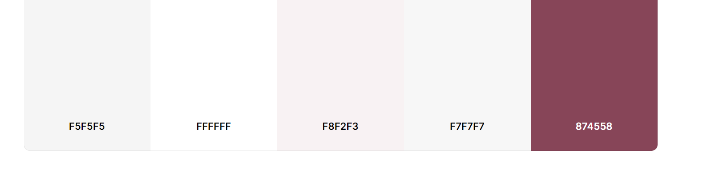

<br>

The colours are muted and quite neutral so as to not overwhelm the user.

 **Typography** 

* As a main font I used Poppins, and as a backup font sans-serif
* On the logo text I used Lora and sans-serif as backup font

<br>

[^ back to top ^](#Table-of-contents)

<br>

---

# FEATURES

## Existing Features 
#### **Navigation menu displayed across all pages**

The navigation menu will help the user move easily across all pages.

The navigation buttons update depending on whether a user is logged in, and whether that user is the admin:

| Nav Link              |Not logged in  |Logged in as user|Logged in as admin
|:-------------         |:------------- |:----------------|:------------- |
|Logo(back to home)     |&#9989;        |&#9989;          |&#9989;
|Product Management     |&#10060;       |&#10060;         |&#9989;
|My Profile             |&#10060;       |&#9989;          |&#9989;
|Sign Out               |&#10060;       |&#9989;          |&#9989;
|Register               |&#9989;        |&#10060;         |&#10060;
|Sign In                |&#9989;        |&#10060;         |&#10060;
|All Products           |&#9989;        |&#9989;          |&#9989;
|Shop                   |&#9989;        |&#9989;          |&#9989;
|Necklaces               |&#9989;        |&#9989;          |&#9989;
|Rings                   |&#9989;        |&#9989;          |&#9989;
|Earrings                |&#9989;        |&#9989;          |&#9989;
|Bracelets                |&#9989;        |&#9989;          |&#9989;
|Contact Us                |&#9989;        |&#9989;          |&#9989;
|Sale                     |&#9989;        |&#9989;          |&#9989;

### **— User registration not required —**

It was important that the user was given the option to purchase from the store without having to register for an account. It's a personal pet peeve of mine to have to make accounts on online stores when I'm not guaranteed to go back again and Jewellery isn't necessarily a regular purchase. 

Even if a user doesn't have an account, they are still able to purchase, input a delivery address and have a confirmation email sent to them when they have completed a purchase. 

### **— User profile creation —**

A user has an option to create an account if they want to. 
Registration process:

+ Username
   + A user can choose a username as long as it hasn't already been taken
   + The user will receive an error notification immediately if their username has already been taken

+ Email address
   + A user needs to sign up using an email address
   + The email has to be inputted twice to avoid typo issues
   + This triggers an automatic email to be sent to the user to confirm the email address as correct and set up the account. 

+ Password
   + The password has to be inputted twice to avoid typo issues

With a user profile: 
+ the user has access to the class videos. 
+ order history is saved & displayed in their profile.
+ Save default delivery information to their profile from the checkout page.
+ Update default delivery information to their profile from their profile page.

---  

### **— Products Page —**

All users can browse through the available products.
Products can be sorted by:
+ Price
+ Rating
+ Category
+ All Products

All users can shop by category under the following categories:

+ Shop:
   + View all
   + Necklaces
   + Rings
   + Earrings
   + Bracelets

If a user wants to know more about a product, they can click it and open the product detail page.

---

### **— Product Details Page —**

From the product detail page, the user can view:
+ Product name
+ Product price
+ Product category
+ Product colour
+ Product rating 
+ Product description 
+ Delivery and Returns info

The user can then either go back to the products page, add a single item to their bag or adjust the quantity to add to the bag

---
### **— Admin CRUD functionality —**

As well as all of the above features(read), the admin can add, edit and delete products from the site - they don't have to visit the admin panel for this. 
+ Add(*Create*): 
From the 'My Account' dropdown, the admin can choose 'Product Management'. This allows them to create the item by filling in the form.

+ Edit(*Update*): 
From the item detail page, the admin has an edit button that will direct them to the edit page. All of the form fields will be populated with the item information that can then be updated and saved. 

+ Delete(*Delete*)
From the item detail page, the admin has a delete button that will trigger a confirmation modal. Once the admin confirms deletion, the item will be removed from the database

---

### **— Wishlist —**

- A user can open the Wishlist page at any point and see what items they have in there. 

- From here a user can remove items from the Wishlist and access the product detail. 

---

### **— Bag —**

- A user can open the bag page at any point and see what items they have in there. 

- From here a user can update product quantities, remove items from the bag or access the checkout page. 

---

### **— Checkout —**

The checkout page allows the user to:
+ use their default delivery address(if they have an account, are logged in and have saved those details)
+ input new delivery information if needed.
+ update their profile with the inputted delivery information(if they have an account and are logged in)
+ Pay via Stripe for secure payments
+ A loading screen will appear when a payment is being processed to stop the user clicking away
+ If the payment form doesn't submit properly or the user closes the browser during the wait animation, Stripe will still create the order for the user. 
+ An email will be sent to the user with their order confirmation

---

### **— Contact page —**

The user can fill out a contact form and send a message to the site admin. This will send an email directly to the admin's email rather than to the admin console. 

---

### **— Toasts —**

There are four types of toasts that are displayed to the user when specific actions happen. This keeps the user informed about what is happening when it happens. The toasts are:

+ Success
   + When a user sucessfully signs in/signs out
   + When a user adds a product to a bag
   + When the user adds a product to their Wishlist
   + When an admin adds/edits items
+ Info
   + When a user is viewing previous order details
+ Warning
   + Stripe key not found 
+ Error
   + When a user is trying to access a page they are not authorized to
   + When an admin's CRUD action fails

*These are just a few examples*

---

## Features to Implement in the future 
+ Users ability to delete their account.
+ A choice of currency selector so a user can shop in their home currency.
+ Alternative payment options such as paypal or amazon pay.
+ An online booking service where shoppers can book a time to come into store to try on particular item, 
given the current covid environment this would be a very useful feature.

<br>

[^ back to top ^](#Table-of-contents)

<br>

---

# Database

Two relational databases were used to create this site - during production SQLite was used and then Postgres was used for the deployed Heroku version. 

<br>

Below is an image of how the database models relate to each other:

<br>

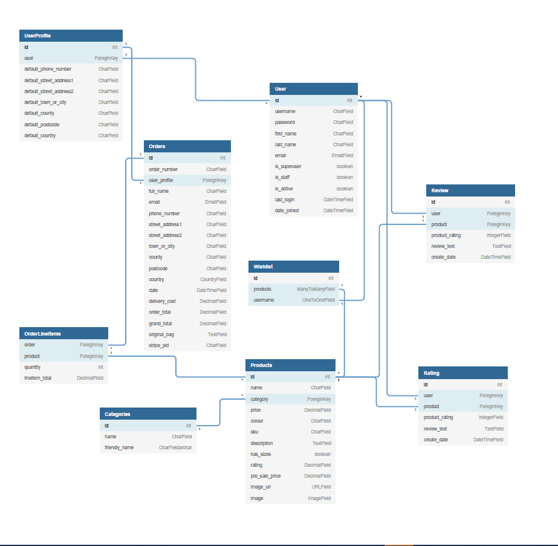

<br>

The database contains three custom models - categories recipes and comments. The built in Django user model was utilized and each model linked to this. Each registered user is assigned a user id. They can add recipes which will be linked to their id, and each recipe has an auto generated slug field (this is derived from the recipe's title). The recipe can be edited and deleted by the person who added it or by admin. 

#### Models
- The following models were created to represent the database model structure for the website
##### User Model
- The User model contains information about the user. It is part of the Django allauth library
- The model contains the following fields: username, password, first_name, last_name, email, is_staff, is_active, is_superuser, last_login, date_joined

##### UserProfile Model
- The UserProfile model has a one-to-one relationship with User
- The model contains the following fields: default_phone_number, default_street_address1, default_street_address2
default_town_or_city, default_county, default_postcode and default_country

##### Order Model
- The Order model contains information about orders made on the website.
- It contains UserProfile as a foreign-key.
- The model contains the following fields: order_number, user_profile, full_name, email, phone_number, country, postcode, town_or_city, street_address1
, street_address2, county, date, delivery_cost, order_total, grand_total, original_bag, stripe_pid

##### OrderLineItem Model
- The OrderLineItem model contains information about an entry in an order, for orders made on the website.
- It contains Order and Product as foreign-keys.
- The model contains the following fields: order, product, product_size, quantity, lineitem_total

##### Wishlist Model
- The Wishlist model contains the users favourite products
- It contains Products as many-to-many field, and User as a one-to-one relationship
- The model contains the following fields: products, username

##### Products Model
- The Product Model represents a product and its details
- It contains Category as a foreign-key
- The model contains the following fields: name, category, price, colour, sku, description, has_sizes, rating, pre_sale_price, image_url, image
- The image field contains the product image
- The image_url field contains the url to where the image file is physically stored, for example AWS S3 bucket

##### Rating Model
- The Rating model contains a rating for a product by a user
- It contains User and Product as foreign-keys.
- The model contains the following fields: user, product, product_rating, review_text, create_date

##### Category Model
- The Category model contains a product category
- The model contains the following fields: name, friendly_name

##### Review Model
- The Review model contains a review of a product by a user
- It contains User and Product as foreign-keys.
- The model contains the following fields: user, product, product_rating, review_text, create_date

---


[^ back to top ^](#Table-of-contents)

<br>

---

# Technologies Used

## Languages

+ [HTML5](https://en.wikipedia.org/wiki/HTML5)
+ [CSS3](https://en.wikipedia.org/wiki/CSS)
+ [JavaScript](https://en.wikipedia.org/wiki/JavaScript)
+ [Python3](https://www.python.org/)

## Frameworks and Libraries

+ [Django3](https://www.djangoproject.com/)
+ [Pip3](https://pip.pypa.io/en/stable/)
+ [jQuery](https://jquery.com/)
+ [FontAwesome](https://fontawesome.com/)
+ [Postgressql](https://www.postgresql.org/) 
+ [Bootstrap 4 ](https://mdbootstrap.com/) 
+ [Google Fonts](https://fonts.google.com/) 

## All Others
+ [Heroku](https://www.heroku.com/) used to deploy live site.
+ [Stripe](https://stripe.com/en-ie) used for the payments system.
+ [AWS](https://aws.amazon.com/) used for file storage.
+ [GitHub](https://github.com/) used to host repository.
+ [GitPod](https://www.gitpod.io/) used to develop project and organise version control.
+ [ResizeImage.net](https://resizeimage.net/) used to cut and re-size site images. 
+ [Balsamiq](https://balsamiq.com/) used to create wireframes.
+ [RandomKeygen](https://randomkeygen.com/) used to create a strong password for required  `<SECRET_KEY>`.
+ [Lighthouse](https://developers.google.com/web/tools/lighthouse) for performance review.
+ [Am I Responsive](http://ami.responsivedesign.is/) used to generate README intro image.
+ [favicon.io](https://favicon.io/) used to create a site favicon.
+ [facebook](https://www.facebook.com/The-Lady-Goldsmith-106978708561394/?ref=pages_you_manage) used to create a facebook business page.
+ [mailchimp](https://mailchimp.com//) used to create a newsletter marketing campaign.
+ [Privacy Policy](https://www.privacypolicygenerator.info/) used to generate a privacy policy generator.
+ [GDPR](https://gdpr.eu/what-is-gdpr/) 


## General Resources

+ Code Institute Course Materials
+ [Stack Overflow](https://stackoverflow.com/)
+ [YouTube](https://www.youtube.com/)
+ [W3schools](https://www.w3schools.com/)
+ [Google](https://www.google.com/)

## Tools

+ [Balsamiq](https://balsamiq.com/) for wireframes
+ [Tinypng](https://tinypng.com/) for resizing images
+ [W3C Markup Validation Service](https://validator.w3.org/) for testing HTML code
+ [W3C CSS Validation Service](https://jigsaw.w3.org/css+validator/) for testing CSS code
+ [jshint](https://jshint.com/) for testing JavaScript code
+ [PEP8 Online](http://pep8online.com/) for checking Python code compliance
+ [Chrome DevTools](https://developers.google.com/web/tools/chrome-devtools) for testing, style checking and debugging


<br>

[^ back to top ^](#Table-of-contents)

<br>

---

# Testing
Due to the size of the testing section, I have created a separate document for it. You can find it [here](). 

<br>

---

# APIs and configuration

The project also uses a number of API's and configuration, below are the steps to configure the API in your environment

## Google emails

To set up the project to send emails and to use a Google account as an SMTP server, the following steps are required
1. Create an email account at google.com, login, navigate to Settings in your gmail account and then click on Other Google Account Settings
2. Turn on 2-step verification and follow the steps to enable
3. Click on app passwords, select Other as the app and give the password a name, for example Django

<br>
<br>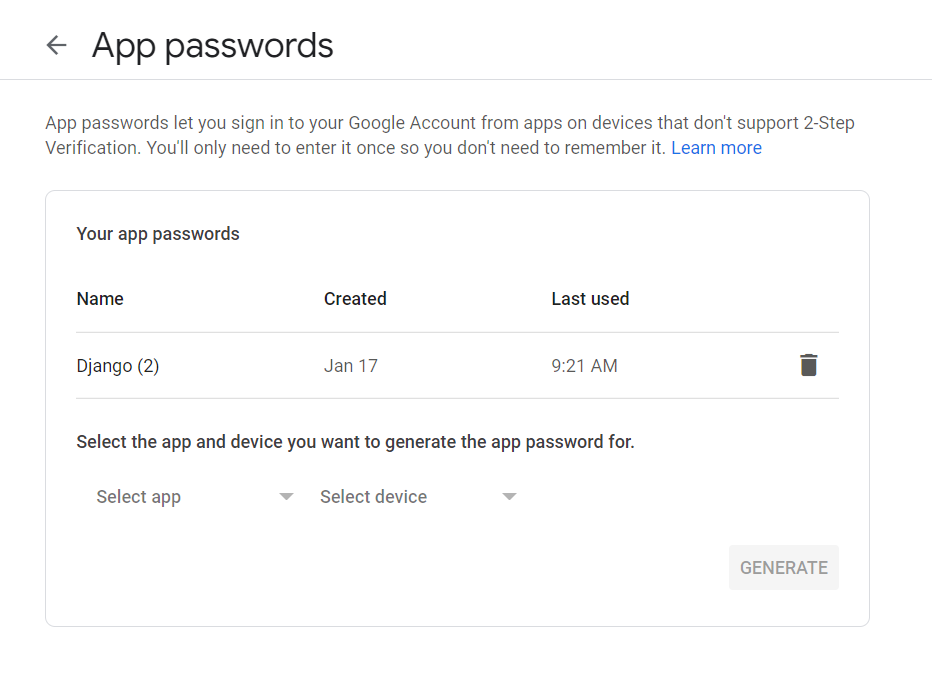
<br>

4. Click create and a 16 digit password will be generated, note the password down
5. Go to heroku app config vars and set

     | Key                    | Value               |
     | -------------          |:------------------- |
     | EMAIL_HOST_PASS           |*paste in password*  |
     | EMAIL_HOST_USER           |*the email used above*  |

7. Set and confirm the following values in the settings.py file to successfully send emails

<br>
<br><code>EMAIL_BACKEND = 'django.core.mail.backends.smtp.EmailBackend'</code>
<br><code>EMAIL_USE_TLS = True</code>
<br><code>EMAIL_PORT = 587</code>
<br><code>EMAIL_HOST = 'smtp.gmail.com'</code>
<br><code>EMAIL_HOST_USER = os.environ.get('EMAIL_HOST_USER')</code>
<br><code>EMAIL_HOST_PASSWORD = os.environ.get('EMAIL_HOST_PASS')</code>
<br><code>DEFAULT_FROM_EMAIL = os.environ.get('EMAIL_HOST_USER')</code>
<br>

## Stripe
1. Register for an account at stripe.com
2. Click on the Developers section of your account once logged in
3. Under Developers, click on the API keys section

<br>
<br>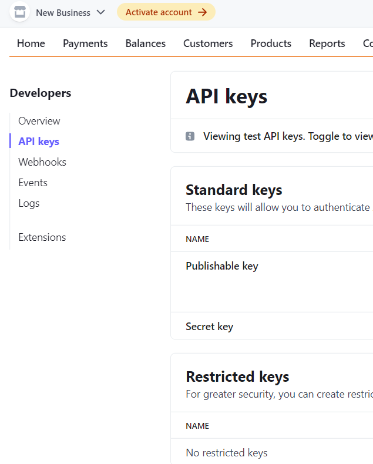
<br>

4. Note the values for the publishable and secret keys
5. In heroku, create environment variables STRIPE_PUBLIC_KEY and STRIPE_SECRET_KEY with the publishable and secret key values

<br>
<br><code>os.environ.setdefault('STRIPE_PUBLIC_KEY', 'YOUR_VALUE_GOES_HERE')</code>
<br><code>os.environ.setdefault('STRIPE_SECRET_KEY', 'YOUR_VALUE_GOES_HERE')</code>
<br>

6. Back in the Developers section of your stripe account click on Webhooks
7. Create a webhook with the url of your website <url>/checkout/wh/, for example: https://ecommerce-pp5.herokuapp.com/checkout/wh/
8. Select the payment_intent.payment_failed and payment_intent.succeeded as events to send

<br>
<br>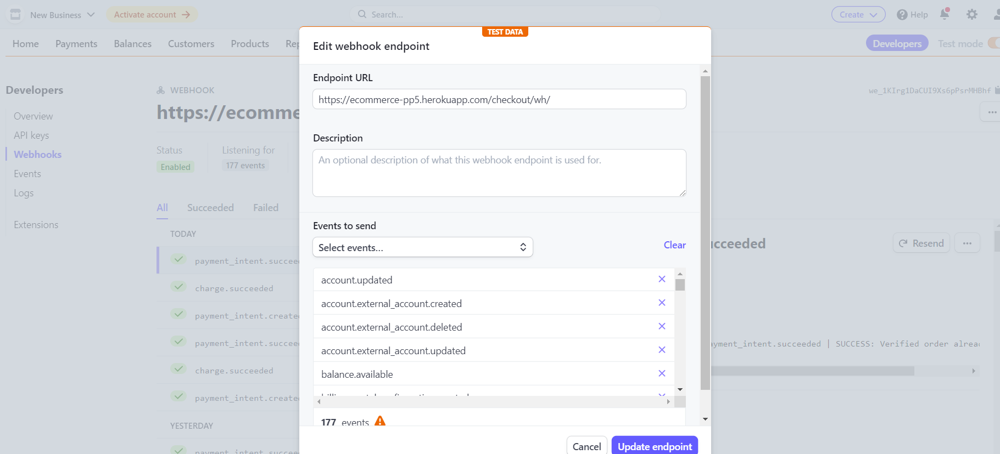
<br>

9. Note the key created for this webhook
10. In heroku, create environment variable STRIPE_WH_SECRET with the secret values
<code>os.environ.setdefault('STRIPE_WH_SECRET', 'YOUR_VALUE_GOES_HERE')</code>
11. Feel free to test out the webhook and note the success/fail attempts for troubleshooting

---

# Deployment
There are a number of applications that need to be configured to run this application locally or on a cloud based service, for example Heroku

## Amazon WebServices
1. Create an account at aws.amazon.com
2. Open the S3 application and create an S3 bucket named "ecommerce-pp5"
3. Uncheck the "Block All Public access setting"
4. In the Properties section, navigate to the "Static Website Hosting" section and click edit
5. Enable the setting, and set the index.html and the error.html values

<br>
<br>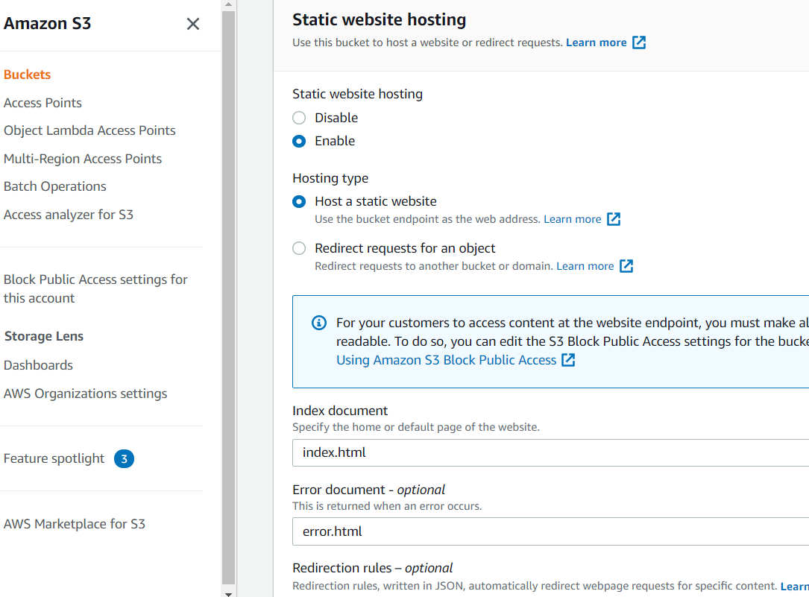
<br>

6. In the Permissions section, click edit on the CORS configuration and set the below configuration

<br>
<br>
<br>

7. In the permissions section, click edit on the bucket policy and generate and set the below configuration(or similar to your settings)

<br>
<br>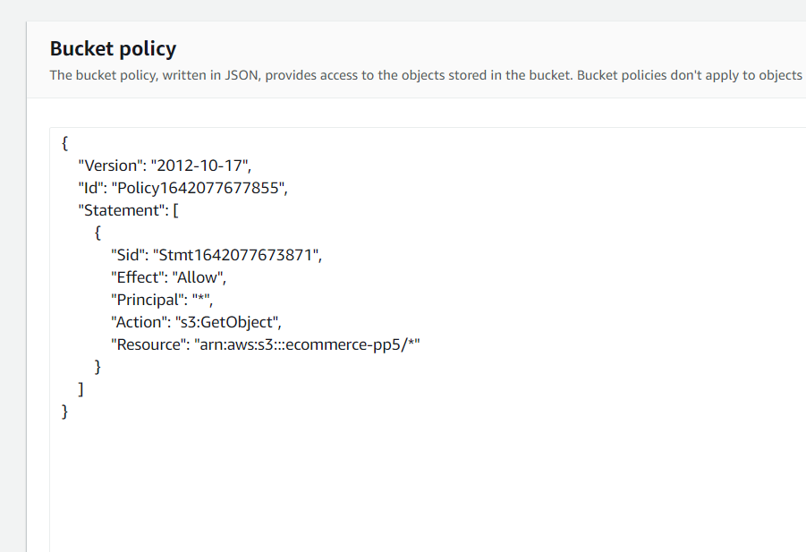
<br>

8. In the permissions section, click edit on the Access control list(ACL)
9. Set Read access for the Bucket ACL for Everyone(Public Access)
10. The bucket is created, the next step is to open the IAM application to set up access
11. Create a new user group named "ecommerce-pp5"
12. Add the "AmazonS3FullAccess" policy permission for the user group
13. Go to "Policies" and click "Create New Policy"
14. Click "Import Managed Policy" and select "AmazonS3FullAccess" > Click 'Import'.
15. In the JSON editor, update the policy "Resource" to the following

<br>
<br><code>"Resource": [</code>
<br><code>"arn:aws:s3:::ecommerce-pp5",</code>
<br><code>"arn:aws:s3:::ecommerce-pp5/*"</code>
<br><code>]</code>
<br>

16. Give the policy a name and click "Create Policy"
17. Add the newly created policy to the user group

<br>
<br>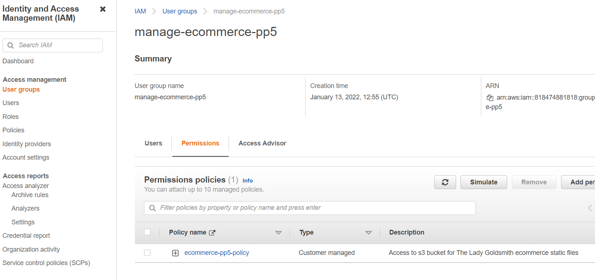
<br>

18. Go to Users and create a new user
19. Add the user to the user group ecommerce-pp5
20. Select "Programmatic access" for the access type
21. Note the AWS_SECRET_ACCESS_KEY and AWS_ACCESS_KEY_ID variables, they are used in other parts of this README for local deployment and Heroku setup
22. The user is now created with the correct user group and policy

<br>
<br>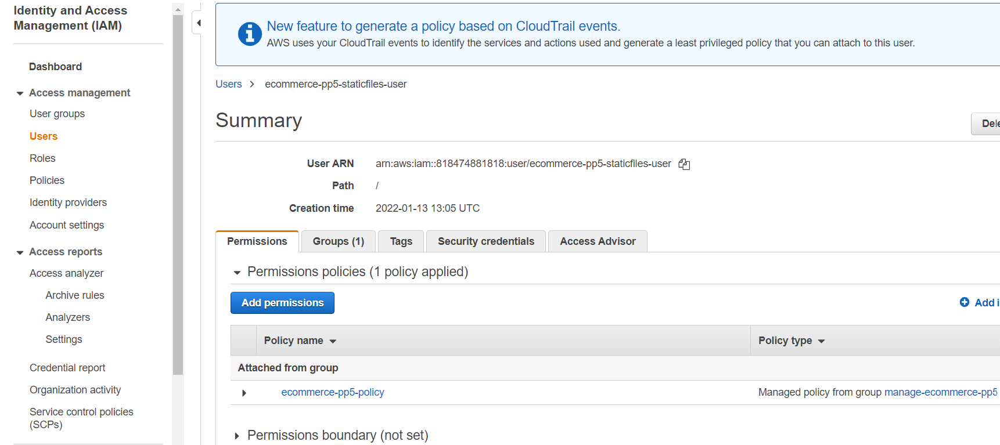
<br>

23. Note the AWS code in settings.py. Note an environment variable called USE_AWS must be set to use these settings, otherwise it will use local storage

<br>
<br>
<br>

24. These settings set up a cache policy, set the bucket name, and the environment variables AWS_ACCESS_KEY_ID and AWS_SECRET_ACCESS_KEY that you set in your aws account
25. The configuration also requires the media/static folders that must be setup in the AWS S3 bucket to store the media and static files 


## Heroku Deployment
This project was deployed through Heroku using the following steps:

### Requirements and Procfile
Heroku needs to know which technologies are being used and any requirements, so I created files to let it know. Before creating the Heroku app, create these files using the following steps in GitPod: 
+ In the GitPod terminal, type ```pip3 freeze --local > requirements.txt``` to create your requirements file.
+ Create your Procfile and insert the following code: ```web: gunicorn ARTstop.wsgi:application``` and make sure there is no additional blank line after it. 
+ Push these files to your repository.

### Creating Heroku App
+ Log into Heroku
+ Select 'Create New App' from your dashboard
+ Choose an app name (if there has been an app made with that name, you will be informed and will need to choose an alternative)
+ Select the appropriate region based on your location
+ Click 'Create App'

### Connecting to GitHub
+ From the dashboard, click the 'Deploy' tab towards the top of the screen
+ From here, locate 'Deployment Method' and choose 'GitHub'
+ From the search bar newly appeared, locate your repository by name
+ When you have located the correct repository, click 'Connect'
+ DO NOT CLICK 'ENABLE AUTOMATIC DEPLOYMENT': This can cause unexpected errors before configuration. We'll come back to this.

### Environment Variables
+ Click the 'Settings' tab towards the top of the page
+ Locate the 'Config Vars' and click 'Reveal Config Vars'
+ The following variables all need to be added:

|Variable name         |Value/where to find value                                |
| ---------------------|---------------------------------------------------------|
|AWS_ACCESS_KEY_ID     |AWS CSV file(instuctions above)                          |
|AWS_SECRET_ACCESS_KEY |AWS CSV file(instuctions above)                          |
|DATABASE_URL          |Postgres generated (instructions above)                  |
|EMAIL_HOST_PASS       |Password from email client                               |
|EMAIL_HOST_USER       |Site's email address                                     |
|SECRET_KEY            |Random key generated online                              |
|STRIPE_PUBLIC_KEY     |Stripe Dashboard > Developers tab > API Keys > Publishable key |
|STRIPE_SECRET_KEY     |Stripe Dashboard > Developers tab > API Keys > Secret key |
|STRIPE_WH_SECRET      |Stripe Dashboard > Developers tab > Webhooks > site endpoint > Signing secret |
|USE_AWS               |True (when AWS set up - instructions below)              |


#### In Heroku.com:
+ From the dashboard, click the 'Deploy' tab towards the top of the screen
+ From here, locate 'Deployment Method' and choose 'GitHub'
+ From the search bar newly appeared, locate your repository by name
+ When you have located the correct repository, click 'Connect'
+ DO NOT CLICK 'ENABLE AUTOMATIC DEPLOYMENT': This can cause unexpected errors before configuration. We'll come back to this
+ Underneath, locate 'Manual Deploy'; choose the main branch and click 'Deploy Branch'
+ Once the app is built (it may take a few minutes), click 'Open App' from the top of the page

<br>

## Forking the Repository
+ Log in to GitHub and locate the GitHub Repository
+ At the top of the Repository above the "Settings" Button on the menu, locate the "Fork" Button.
+ You will have a copy of the original repository in your GitHub account.
+ You will now be able to make changes to the new version and keep the original safe. 

<br>

## Making a Local Clone
+ Log into GitHub.
+ Locate the repository.
+ Click the 'Code' dropdown above the file list.
+ Copy the URL for the repository.
+ Open Git Bash on your device.
+ Change the current working directory to the location where you want the cloned directory.
+ Type ```git clone``` in the CLI and then paste the URL you copied earlier.
+ Press Enter to create your local clone.

<br>

[^ back to top ^](#Table-of-contents)

<br>

---

# Credits
### Code
* The Code Institute material was the main source of information used to create this project.
* The initial site functionality was made using the [Boutique Ado](https://github.com/ckz8780/boutique_ado_v1) walkthrough by [Chris Zielinski](https://github.com/ckz8780) via Code Institute. The code was adapted for what I needed.
* I used [this Stack Overflow post](https://stackoverflow.com/questions/2902008/django-how-do-i-add-arbitrary-html-attributes-to-input-fields-on-a-form) to get a better understanding of how to add HTML attributes to Django generated forms
* The [Django Docs](https://docs.djangoproject.com/en/3.2/) were an invaluable source of information throughout this project
* [Bootstrap](https://getbootstrap.com/) for creating a responsive site.
* [w3schools](https://www.w3schools.com/) was used as a general source of knowledge 
* [MND Web Docs](https://developer.mozilla.org/en-US/docs/Web/CSS/flex-direction) was used as a general source of knowledge.
* [youtube](https://www.youtube.com/) 
* [Stack Overflow](https://stackoverflow.com/) 
* [Django docs](https://docs.djangoproject.com/en/3.2/) django documentation.


### Media
* All images were sources through [Unsplash](https://unsplash.com/collections/JAv8ANNvWyg/jewellery)
* Product description we made up to match the images sourced.

### Acknowledgements
* I would like to thank the Slack Community for their endless support.
* I would like to thank Kasia Bogucka our class cohort facilitator for her constant assistance and encouragement.
* I would like to thank my husband for his understanding and support and for caring for our young children during the long hours taken to complete this project. 
* Finally, I would like to thank my mentor Adegbenga Adeye for his guidence and feedback throughout this project.
 
***