# Testing
## Contents
+ [Validator Testing](#validator-testing)
+ [Lighthouse Testing](#lighthouse-testing)
+ [Testing From User Stories](#testing-from-user-stories)
+ [Manually Testing Functionality](#manually-testing-functionality)
+ [Responsive Testing](#responsive-testing)
+ [Bugs and Fixes](#bugs-and-fixes)
+ [Known Bugs](#known-bugs)
---
---

# Validator Testing
The website's pages was tested against the following validators:

## HTML Markup Validation Service
I used https://validator.w3.org/ to validate the html files

Page | Result | Test Detail/Screenshot
------------ | ------------- | -------------
bag/templates/bag/bag.html  | 0 errors and 0 contrast errors| [Results](readme/html_validation/bag-page.png) 
bag/templates/bag/bag.html (Empty)  | 0 errors and 0 contrast errors| [Results](readme/html_validation/bag-page-empty.png) 
checkout/templates/checkout/checkout.html | 0 errors and 0 contrast errors| [Results](readme/html_validation/checkout-page.png)  
checkout/templates/checkout/checkout_success.html | 0 errors and 0 contrast errors| [Results](readme/html_validation/checkout-success.png)    
contact/templates/contact/contact.html | 0 errors and 0 contrast errors| [Results](readme/html_validation/contact-page.png)    
home/templates/home/index.html | 0 errors and 0 contrast errors| [Results](readme/html_validation/home-page.png)
products/templates/products/add_product.html | 0 errors and 0 contrast errors| [Results](readme/html_validation/add-products-page.png)
products/templates/products/edit_product.html | 0 errors and 0 contrast errors| [Results](readme/html_validation/edit-products-page.png)  
products/templates/products/product_detail.html | 0 errors and 0 contrast errors| [Results](readme/html_validation/edit-products-detail-page.png) 
products/templates/products/products.html | 0 errors and 0 contrast errors| [Results](readme/html_validation/products-page.png)   
products/templates/products/sale_items.html | 0 errors and 0 contrast errors| [Results](readme/html_validation/sale-page.png)     
profile/templates/profile/profile.html | 0 errors and 0 contrast errors| [Results](readme/html_validation/profile-page.png)    
templates/allauth/account/login.html | 0 errors and 0 contrast errors| [Results](readme/html_validation/login-page.png)
templates/allauth/account/logout.html | 0 errors and 0 contrast errors| [Results](readme/html_validation/logout-page.png)
templates/allauth/account/register.html | 0 errors and 0 contrast errors| [Results](readme/html_validation/register-page.png)
wishlist/templates/wishlist/wishlist.html | 0 errors and 0 contrast errors| [Results](readme/html_validation/wishlist-page.png) 
 

## CSS Validation Service
I used https://jigsaw.w3.org/css-validator/ to validate the css(style.css)

    

Page | Result | Test Detail/Screenshot
------------ | ------------- | -------------
static/css/base.css | Passed, No errors found | [Results](readme/css_validation/css-validation.png) 
checkout/static/checkout/css/checkout.css | Passed, No errors found | [Results](readme/css_validation/css-validation-checkout.png)  

 

## JSHint
I checked the all the JavaScript files using [JSHint](https://jshint.com/)

There were a few missing semicolons and ES6 version issues but they were easy fixes. 

 

## PEP8online
I checked the Py files using [PEP8 online](http://pep8online.com/)

The code passed all checks.

Page | Result 
------------ | ------------- 
bag/admin.py | No errors/warnings 
bag/apps.py | No errors/warnings 
bag/contexts.py | No errors/warnings 
bag/models.py | No errors/warnings 
bag/urls.py | No errors/warnings 
bag/views.py | No errors/warnings 
checkout/admin.py | No errors/warnings 
checkout/apps.py | No errors/warnings 
checkout/forms.py | No errors/warnings 
checkout/models.py | No errors/warnings 
checkout/signals.py | No errors/warnings 
checkout/urls.py | No errors/warnings 
checkout/views.py | No errors/warnings 
contact/apps.py | No errors/warnings 
contact/forms.py | No errors/warnings 
contact/models.py | No errors/warnings 
contact/urls.py | No errors/warnings 
contact/views.py | No errors/warnings 
contact/webhook_handler.py | No errors/warnings 
contact/webhooks.py | No errors/warnings  
home/admin.py | No errors/warnings 
home/apps.py | No errors/warnings 
home/models.py | No errors/warnings  
home/urls.py | No errors/warnings 
home/views.py | No errors/warnings 
products/admin.py | No errors/warnings 
products/apps.py | No errors/warnings 
products/forms.py | No errors/warnings 
products/models.py | No errors/warnings 
products/urls.py | No errors/warnings 
products/views.py | line 55 is 1 character too long, |
..................| (I was unable to split this line without breaking my code so I left it as it was.)
products/widgets.py | No errors/warnings 
profiles/admin.py | No errors/warnings 
profiles/apps.py | No errors/warnings 
profiles/forms.py | No errors/warnings 
profiles/models.py | No errors/warnings 
profiles/urls.py | No errors/warnings 
profiles/views.py | No errors/warnings
wishlist/admin.py | No errors/warnings 
wishlist/apps.py | No errors/warnings 
wishlist/contexts.py | No errors/warnings 
wishlist/models.py | No errors/warnings 
wishlist/urls.py | No errors/warnings 
wishlist/views.py | No errors/warnings 
custom_storages.py | No errors/warnings
manage.py | No errors/warnings
 

[^ back to top ^](#contents)

# Lighthouse Testing 

- I used Lighthouse (https://developers.google.com/web/tools/lighthouse) to test the performance, seo, best practices and accessibility of the site
- Overall the results are very good for the 4 values: Performance, Accessibility, Best Practices and SEO

### Desktop
Page  | Performance (%) | Accessibility (%) | Best Practices (%) | SEO (%)
------------  | ------------ | ------------- | ------------- | -------------
bag/templates/bag/bag.html | 98 | 93 | 93 | 100 |
checkout/templates/checkout/checkout.html | 90 | 94 | 93 | 100 |
checkout/templates/checkout/checkout_success.html | 97 | 93 | 93 | 100 ||
contact/templates/contact/contact.html | 98 | 93 | 93 | 100 |
home/templates/home/index.html | 90 | 94 | 93 | 100 ||
products/templates/products/add_product.html | 98 | 84 | 93 | 89 |
products/templates/products/edit_product.html | 98 | 85 | 87 | 90 |
products/templates/products/product_detail.html | 93 | 77 | 87 | 90 |
products/templates/products/products.html  | 73 | 93 | 87 | 90 |
products/templates/products/sale_items.html | 96 | 93 | 93 | 100 |
profile/templates/profile/profile.html | 94 | 93 | 93 | 89 |
templates/allauth/account/login.html | 97 | 93 |93 | 100 |
templates/allauth/account/logout.html | 99 | 93 | 93 | 100 |
templates/allauth/account/register.html | 98| 93 | 93 | 100 |
wishlist/templates/wishlist/wishlist.html | 97 | 100 | 87 | 90 |

### Mobile
Page  | Performance (%) | Accessibility (%) | Best Practices (%) | SEO (%)
------------  | ------------ | ------------- | ------------- | -------------
bag/templates/bag/bag.html | 96 | 96 | 80 | 100 |
checkout/templates/checkout/checkout.html | 82 | 100 | 80 | 100 |
checkout/templates/checkout/checkout_success.html | 95 | 100 | 87 | 100 ||
contact/templates/contact/contact.html | 95 | 100 | 87 | 100 |
home/templates/home/index.html | 91 | 100 | 87 | 100 ||
products/templates/products/add_product.html | 94 | 92 | 87 | 100 |
products/templates/products/edit_product.html | 97 | 92 | 87 | 100 |
products/templates/products/product_detail.html | 96 | 100 | 80 | 100 |
products/templates/products/products.html  | 96 | 100 | 87 | 100 |
products/templates/products/sale_items.html | 96 | 100 | 87 | 100 |
profile/templates/profile/profile.html | 97 | 100 | 87 | 100 |
templates/allauth/account/login.html | 94 | 100 |87 | 100 |
templates/allauth/account/logout.html | 93 | 100 | 87 | 100 |
templates/allauth/account/register.html | 98| 100 | 87 | 100 |
wishlist/templates/wishlist/wishlist.html | 97 | 100 | 87 | 90 ||

 

[^ back to top ^](#contents)
---
---
# Testing From User Stories

### As an Unregistered user, I want to: 
+ *see that the navigation bar is displayed with a logo on all pages so I can easily find my way through the site.*

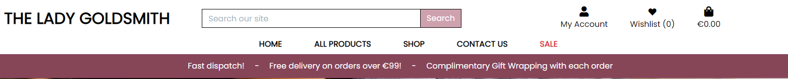

---
+ *browse through all available products so I can select some items I wish to purchase.*

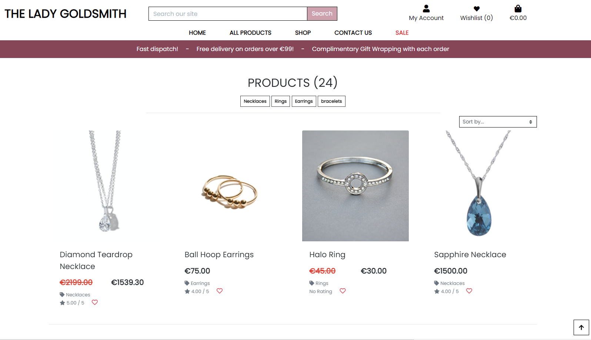

---
+ *be able to view individual product details so I can identify the price, product description, rating and images.*

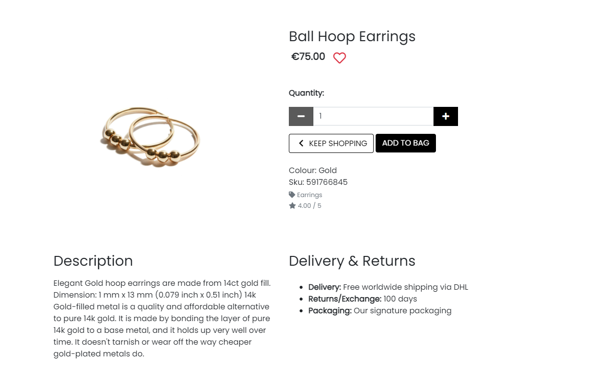

---
+ *easily register an account so I can have a personal account and view my profile.*

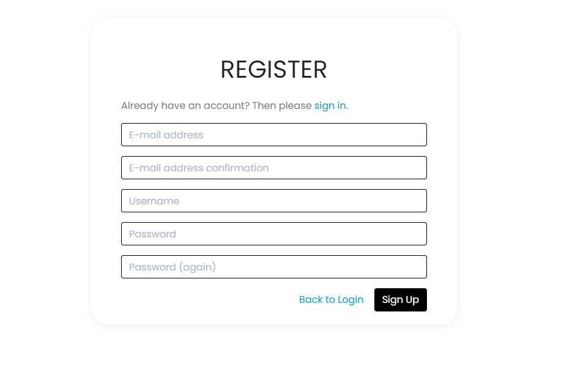

---
+ *receive email confirmation after registering so I can verify that my account registration was successful.*

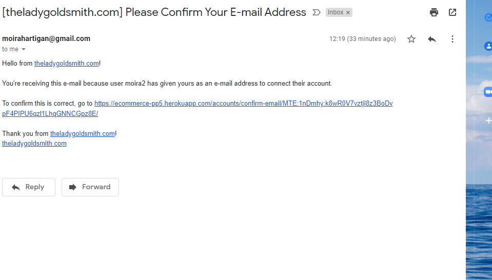

---
+ *be able to use the search option so I can search the site for specific keywords.*

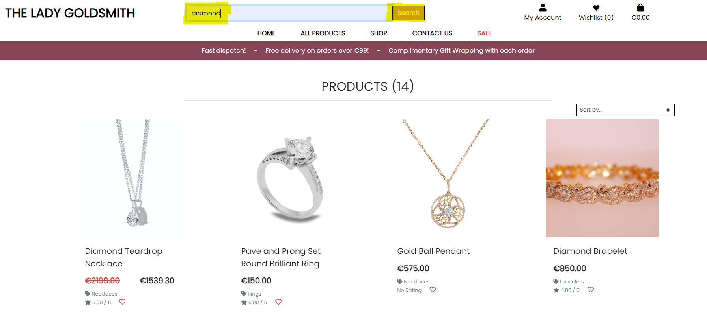

---
+ *be able to browse the Sale Items*

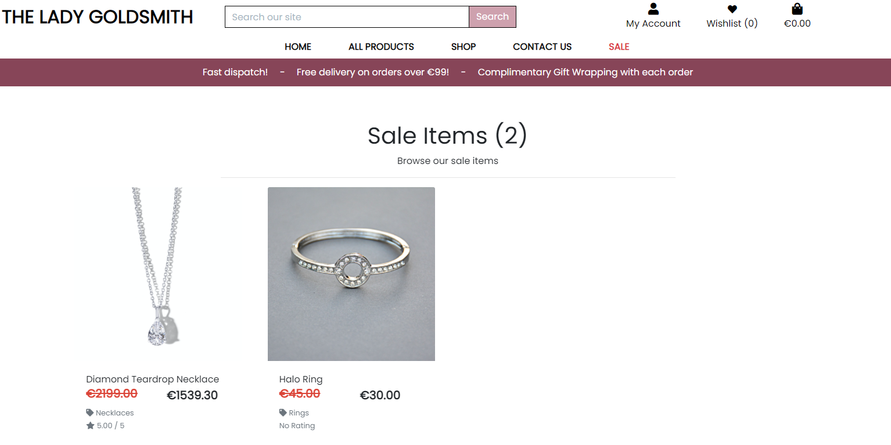

---
+ *be able to send a message to the business from the contact page.*

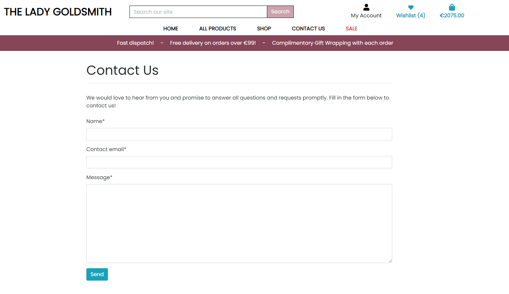

---

### As a registered user, I want to:
+ *have the ability to log in to the site so I can access my personal details.*

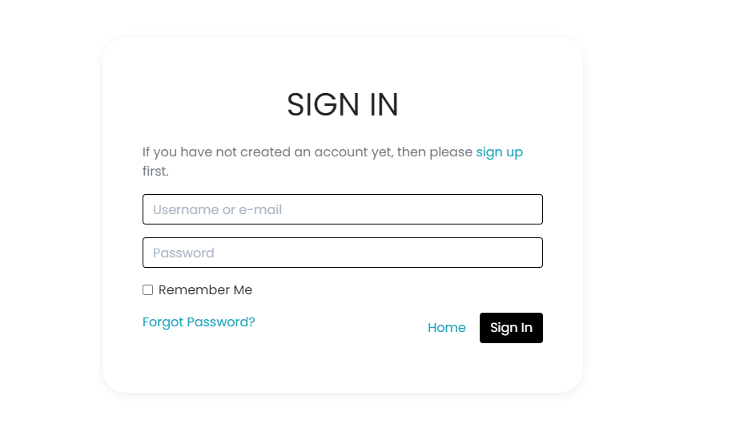

---
+ *be able to view items in my shopping bag to be purchased so I can identify the total cost of my purchase and all the items I will receive.*

---
+ *add products to my Wishlist so I can keep track of the items I like the most for a future site visit.*

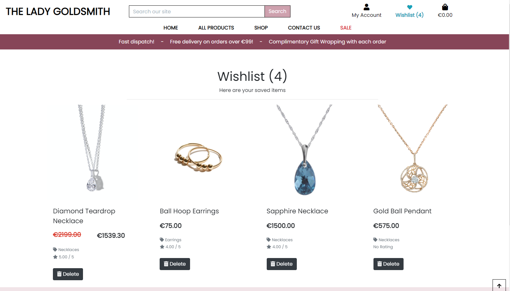

---
+ *view my shopping bag and any items I currently have awaiting payment in my bag so I can avoid spending too much.*

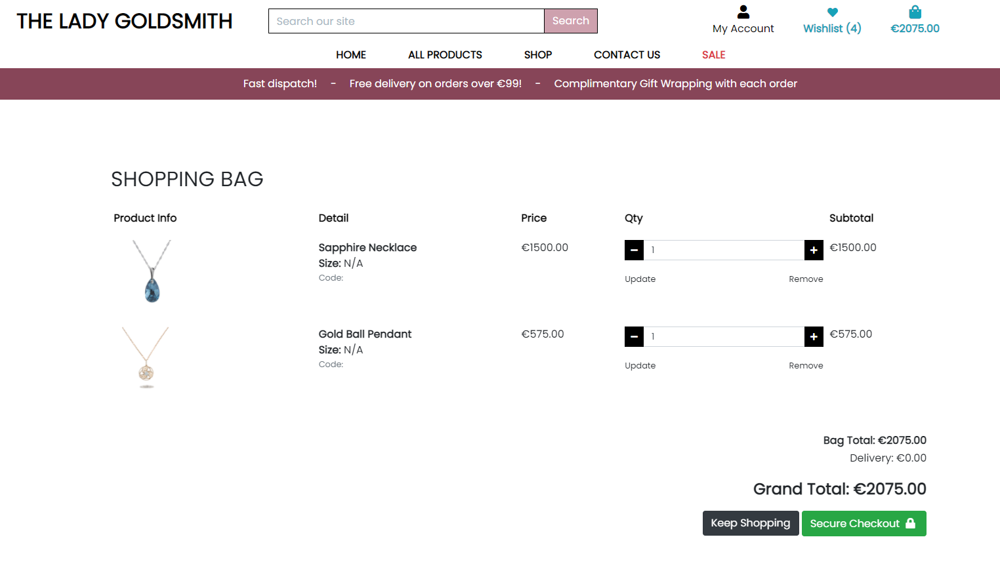

---
+ *easily enter my payment information so I can checkout quickly and with no issues.*

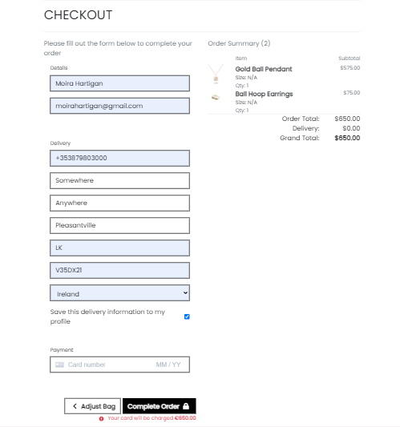

---
+ *easily recover my password if I forget it so I can regain access to my account information.*

---
+ *have a personalized user profile so I can view my personal order history and save my payment information.*

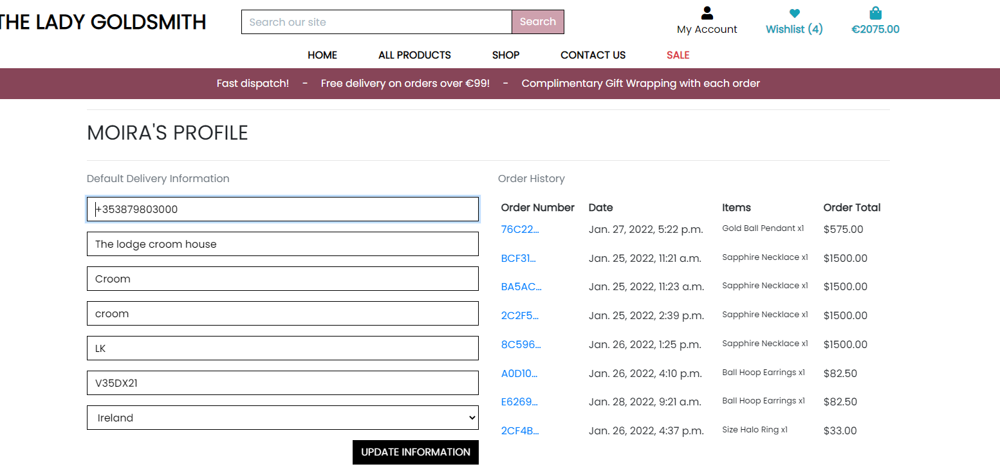

---

### As a site admin, I want to:
+ *be able to log in to an admin panel so I can see all product/ order and users.*

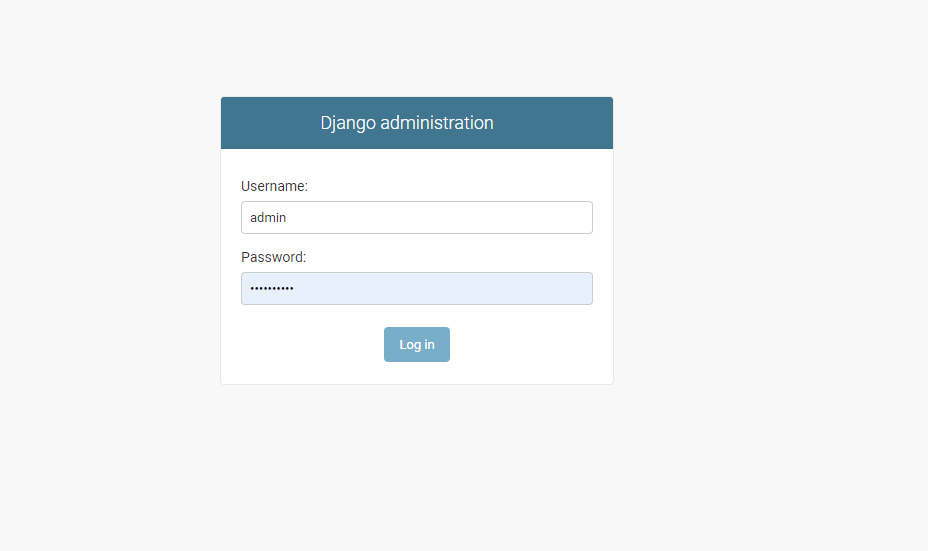

---
+ *be able to add, update or remove products so I can make changes without visiting the admin pane.*

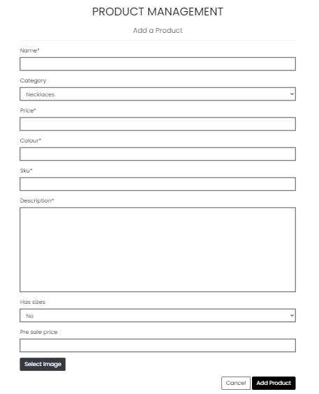
 
Once the items have been uploaded, the admin will be able to edit/delete from the item detail page:

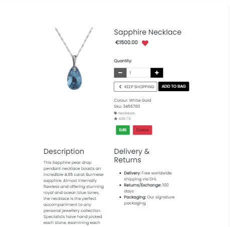

The edit button will open a form that is a replica of the add form but with the previous information populating the fields.
To ensure that an item isn't deleted by mistake, a confirmation has been added to each item:

---
+ *Receive email notifications when a user submits through the contact page so I can respond to the customers query in a timely manor.*

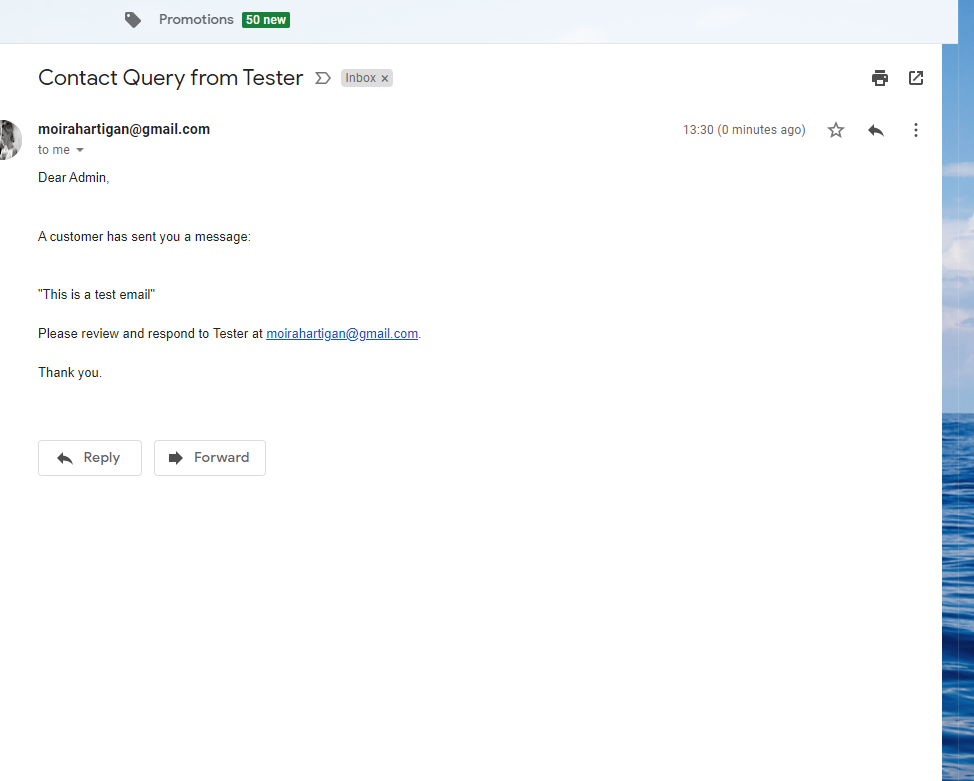

---

 

# Manually Testing Functionality
### **Navigation**

|Element               |Action|Expected Result               |Pass/Fail|
|:-------------         |:----|:----------------------------------|:---|
| **NavBar**            |                                         |    |
|Site Name (logo area)  |Click|Redirect to home                   |Pass|
|My profile Dropdown    |Click|Open profile dropdown              |Pass|
|Register Link          |Click|Redirect to register page          |Pass|
|                       |     |(Not visible if user in session)   |Pass|
|Log In Link            |Click|Redirect to log in page            |Pass|
|                       |     |(Not visible if user in session)   |Pass|
|Product Management Link|Click|Redirect to add_product page       |Pass|
|                       |     |(Only visble if admin in session)  |Pass|
|My Profile Link        |Click|Redirect to user profile page      |Pass|
|                       |     |(Only visble if user in session)   |Pass|
|Logout Link            |Click|Redirect to logout confirm  page   |Pass|
|                       |     |(Only visble if user in session)   |Pass|
|Wishlist               |Click|Redirect to wishlist page          |Pass|
**if user not in session** |     |                          |    |
|Wishlist               |Click|Redirect to login page            |Pass|
|Bag Link               |Click|Redirect to bag page               |Pass|
| **SideNav**           |     |                                   |    |
|Hamburger Icon         |Click|Open Sidenav                       |Pass|
|Site Name (logo area)  |Click|Redirect to home                   |Pass|
|My profile Dropdown    |Click|Open profile dropdown              |Pass|
|Register Link          |Click|Redirect to register page          |Pass|
|                       |     |(Not visible if user in session)   |Pass|
|Log In Link            |Click|Redirect to log in page            |Pass|
|                       |     |(Not visible if user in session)   |Pass|
|Product Management Link|Click|Redirect to add_product page       |Pass|
|                       |     |(Only visble if admin in session)  |Pass|
|My Profile Link        |Click|Redirect to user profile page      |Pass|
|                       |     |(Only visble if user in session)   |Pass|
|Logout Link            |Click|Redirect to logout confirm  page   |Pass|
|                       |     |(Only visble if user in session)   |Pass|
| **MainNav**           |     |                                   |    |
|All Products Link      |Click|Redirect all products page         |Pass|
|By Price Link          |Click|Redirect to products page filtered to price |Pass|
|By Rating Link         |Click|Redirect to products page filtered to rating  |Pass|
|By Category Link       |Click|Redirect to prints page filtered to category |Pass|
|All Products Link      |Click|Redirect to products page            |Pass|
|Shop Dropdown          |Click|Open Category list                |Pass|
|View all Link          |Click|Redirect to products page filtered by category |Pass|
|Necklaces              |Click|Redirect to products page filtered by necklaces   |Pass|
|Rings                  |Click|Redirect to products page filtered by rings   |Pass|
|Earrings               |Click|Redirect to products page filtered by earrings    |Pass|
|Bracelets              |Click|Redirect to products page filtered by bracelets    |Pass|
|Contact Us             |Click|Redirect to Contact us page         |Pass|
|Classes Dropdown       |Click|Open classes Dropdown              |Pass|
|Sale                   |Click|Redirect to sale page     |Pass|
| **Carousel**              |     |                          |    |
|Carousel image 1           |Click|Redirect to Earrings      |Pass|
|Carousel image 1           |Click|Redirect to Necklaces    |Pass|
|Carousel image 1           |Click|Redirect to Rings        |Pass|
|Carousel image 1           |Click|Redirect to Bracelets   |Pass|
| **Footer**                |     |                               |    |
|*Socials*                  |     |                               |    |
|Facebook Link              |Click|Open on facebook business page |Pass|
|Twitter Link               |Click|Open on external page          |Pass|
|Instagram Link             |Click|Open on external page          |Pass|
|Instagram Link             |Click|Open on external page          |Pass|
|TikTok Link                |Click|Open on external page          |Pass|
|*Products*            |     |                          |    |
|Bracelets              |Click|Redirect to bracelets    |Pass|
|Rings                  |Click|Redirect to rings   |Pass|
|Necklaces              |Click|Redirect to necklaces   |Pass|
|Earrings               |Click|Redirect to earrings    |Pass|
|*Useful Links*                  |     |                          |    |
|**if user not in session** |     |                          |    |
|Log in Link                |Click|Redirect to login page    |Pass|
|Register Link              |Click|Redirect to signup page   |Pass|
|**if user in session**     |     |                          |    |
|profile Link               |Click|Redirect to profile page  |Pass|
|Log out Link               |Click|Redirect to log out confirmation page|Pass|
|**if admin in session**    |Click|Open on external page     |Pass|
|Product Management Link    |Click|Redirect to add product page|Pass|

### **Products Page**

| Element                   | Action | Expected Result         | Pass/Fail |
|:-------------             |:-------|:-----                        |:-----|
|'Sort By' Dropdown         |Click   |Open 'sort by' options          |Pass|
|'Sort By' Options (x4)     |Click   |Re-order products               |Pass|
|If category selected:      |        |                                |Pass|
|Category button            |Click   |                                |Pass|
|Product image              |Click   |Redirect to product detail page |Pass|
|Wishlist icon              |Click   |Redirect to product detail page |Pass|
|**if user not in session** |     |                          |    |
|Wishlist                   |Click|Redirect to login page    |Pass|
---

### **Product Detail Page**

| Element                   | Action | Expected Result         | Pass/Fail |
|:-------------             |:-------|:-----                        |:-----|
|Qty control buttons        |Click   |Increase/decrease quantity    |Pass|
|Keep Shopping button       |Click   |Redirect to products page     |    |
|Add to bag button          |Click   |Add item to bag               |Pass|
|                           |        |Toast Success appears         |Pass|
|                           |        |Item visible in toast success |Pass|
|Wishlist icon              |Click   |Redirect to product detail page |Pass|
|**if user not in session** |        |                          |    |
|Wishlist                   |Click   |Redirect to login page    |Pass|
|**If admin in session:**   |        |                              |    |
|Edit product button        |Click   |Redirect to edit product page |Pass|
|Delete product button      |Click   |Open delete confirmation modal|Pass|
|Modal cancel button        |Click   |Close modal                   |Pass|
|Modal delete button        |Click   |Delete product                |Pass|
| **Reviews**               |        |                          |    |
|**If user not in session** |        |                          |    |
|Reviews                    |Click   |Redirect to login page    |Pass|
|**If user in session:**   |        |                              |    |
|Form dropdown              |Click   |Show dropdown options        |Pass|
|Form Text Input         |Just input whitespace|On Submit: Form won't submit |Pass  |
|Post Review button(form valid) |Click      |Form submit                     |Pass  |
|                               |           |Redirect to product detail page |Pass  |
|                               |           |Product uploaded toast appears  |Pass  |
|Post Review button(form invalid)|Click     |Form doesn't submit             |Pass  |
|                               |           |Error messages on invalid fields|Pass  |
|Edit review button        |Click   |Redirect to edit product page |Pass|
|Delete Review button      |Click   |Open delete confirmation modal|Pass|
|Modal cancel button        |Click   |Close modal                   |Pass|
|Modal delete button        |Click   |Delete product                |Pass|

---

### **Add Product Page**

| Element                       | Action    | Expected Result                | Pass/Fail |
|:-------------                 |:----------|:-----                          |:-----|
|Form Text Input (if required)  |Leave blank|On Submit: Warning appears, form won't submit |Pass  |
|Form Dropdowns                 |Click      |Show dropdown options           |Pass  |
|Form Number field              |Type into  |Click up/down|increase/decrease value       |Pass  |
|Form Text Input (if required)  |Fill In    |On Submit: Form submit          |Pass  |
|Form Text Input         |Just input whitespace|On Submit: Form won't submit |Pass  |
|                               | |On Submit: error message on invalid field |Pass  |
|Form Text Input         |Just input whitespace|On Submit: Form won't submit |Pass  |
|                               | |On Submit: error message on invalid field |Pass  |
|                               |Type into  |Correcct format:Accept value    |Pass  |
|Form Dropdowns                 |Click      |Show dropdown options           |Pass  |
|Form Number field              |Type into  |Click up/down|increase/decrease value       |Pass  |
|Form image select button       |Click      |Open device storage             |Pass  |
|                               |           |Chosen image name displayed     |Pass  |
|Cancel button                  |Click      |Redirect to products page       |Pass  |
|Add Product button(form valid) |Click      |Form submit                     |Pass  |
|                               |           |Redirect to product detail page |Pass  |
|                               |           |Product uploaded toast appears  |Pass  |
|Add Product button(form invalid)|Click     |Form doesn't submit             |Pass  |
|                               |           |Error messages on invalid fields|Pass  |

---

### **Edit Product Page**

| Element                       | Action    | Expected Result                | Pass/Fail |
|:-------------                 |:----------|:-----                          |:-----|
|All form fields                |On load    |Populated with original values  |Pass  |
|Form Dropdowns                 |Click      |Show dropdown options           |Pass  |
|Form Number field              |Type into  |Click up/down|increase/decrease value       |Pass  |
|Form Text Input (if required)  |Fill In    |On Submit: Form submit          |Pass  |
|Form Text Input         |Just input whitespace|On Submit: Form won't submit |Pass  |
|                               | |On Submit: error message on invalid field |Pass  |
|Form Text Input         |Just input whitespace|On Submit: Form won't submit |Pass  |
|                               | |On Submit: error message on invalid field |Pass  |
|                               |Type into  |Correcct format:Accept value    |Pass  |
|Form Dropdowns                 |Click      |Show dropdown options           |Pass  |
|Form Number field              |Type into  |Click up/down|increase/decrease value       |Pass  |
|Form image select button       |Click      |Open device storage             |Pass  |
|                               |           |Chosen image name displayed     |Pass  |
|Cancel button                  |Click      |Redirect to products page       |Pass  |
|Update Product button(form valid)|Click    |Form submit                     |Pass  |
|                               |           |Redirect to product detail page |Pass  |
|                               |           |Product updated toast appears   |Pass  |
|Update Product button(form invalid)|Click  |Form doesn't submit             |Pass  |
|                               |           |Error messages on invalid fields|Pass  |

---

### **Bag Page**

| Element                   | Action | Expected Result               | Pass/Fail |
|:-------------             |:-------|:-----                              |:-----|
|**No Bag Items**           |        |                                    |      |
|Shop button                |Click   |Redirect to products page           |Pass  |
|**Bag Items**              |        |                                    |      |
|Qty control buttons        |Click   |Increase/decrease quantity          |Pass  |
|Update button              |Click   |Update bag item quantity            |Pass  |
|                           |        |Updated confirmation toast appears  |Pass  |
|Remove button              |Click   |Remove item from bag                |Pass  |
|                           |        |Removed confirmation toast appears  |Pass  |
|Continue shopping button   |Click   |Redirect to products page           |Pass  |
|Checkout button     |Click (user logged in)|Redirect to checkout page |Pass  |
|       |Click (user not logged in)|Redirect to continue as guest page |Pass  |

---

### **Continue as Guest Page**

| Element                   | Action | Expected Result              | Pass/Fail |
|:-------------             |:-------|:-----                             |:-----|
|Page access      |On load (user logged in)|Redirect to checkout page |Pass  |
|Page access          |On load (user logged in)|Page accessible       |Pass  |
|Sign In button             |Click   |Redirect to log in page            |Pass  |
|Register button            |Click   |Redirect to sign up page           |Pass  |
|Continue as guest button   |Click   |Redirect to checkout page          |Pass  |

---

### **Checkout Page**

| Element                   | Action           | Expected Result                      | Pass/Fail |
|:-------------             |:-----------------|:-----                                     |:-----|
|Page accessible            |Direct URL input (empty bag)|redirect to products page     |Pass  |
|                           |                  |empty bag toast appears                    |Pass  |
|Form fields(if user logged in)|On load |fields populated with user default info(if previously saved)|Pass  |
|Text Input(if required)    |Leave blank       |On submit:form won't submit                |Pass  |
|                           |                  |error message on invalid field(s)          |Pass  |
|                           |Just whitespace   |On submit:form won't submit                |Pass  |
|                           |                  |error message at bottom of page            |Pass  |
|                           |Fill in correctly |On submit: form submits                    |Pass  |
|Phone number Input         |Leave blank       |On submit:form won't submit                |Pass  |
|                           |                  |error message on field                     |Pass  |
|                           |Just whitespace   |On submit:form won't submit                |Pass  |
|                           |                  |error message at bottom of page            |Pass  |
|                   |Use non numeric characters|On submit: form submits   |**Fail** (see known bugs)|
|                           |                  |error on field            |**Fail** (see known bugs)|
|Email Input                |Leave blank       |On submit:form won't submit                |Pass  |
|                           |                  |error message on field                     |Pass  |
|                           |Just whitespace   |On submit:form won't submit                |Pass  |
|                           |                  |error message at bottom of page            |Pass  |
|                           |Fill in correctly |On submit: form submits                    |Pass  |
|Form Dropdown              |Click             |Show dropdown options                      |Pass  |
|Save to profile checkbox   |On load(user logged in)|Shown                                 |Pass  |
|                           |On load(user not logged in)|Not shown                         |Pass  |
|                           |Checked |On submit:Delivery information saved to user profile |Pass  |
|                     |Unchecked |On submit:Delivery information not saved to user profile |Pass  |
|Payment card input         |Input invalid card number|Error message on field              |Pass  |
|                           |Input invalid card date|Error message on field                |Pass  |
|                           |On load(user not logged in)|Not shown                         |Pass  |
|Adjust Bag button          |Click             |Redirect to bag page                       |Pass  |
|Complete Order button(form invalid)|Click     |Form won't submit                          |Pass  |
|                           |                  |Error message on invalid fields            |Pass  |
|Complete Order button(form valid)|Click       |                                           |      |
|                           |Payment succeeds  |loading screen reappears                   |Pass  |
|                           |                  |form submits                               |Pass  |
|                           |                  |redirect to order confirmation page        |Pass  |
|                           |(if user logged in)|order saved to user profile               |Pass  |
|                           |Payment failed    |Loading animation appears                  |Pass  |
|                           |                  |form won't submit                          |Pass  |
|                           |                  |error message at bottom of form            |Pass  |
|              |Payment Requires authentication|Loading animation appears                  |Pass  |
|                           |                  |Authentication box appears                 |Pass  |
|Fail Authentication button |Click             |Authentication box closes                  |Pass  |
|                           |                  |User directed back to form                 |Pass  |
|                           |                  |error message at bottom of form            |Pass  |
|Complete Authentication button|Click          |loading screen reappears                   |Pass  |
|                           |                  |form submits                               |Pass  |
|                           |                  |redirect to order confirmation page        |Pass  |
|                           |(if user logged in)|order saved to user profile               |Pass  |

---

### **Checkout Success Page**

| Element                   | Action | Expected Result         | Pass/Fail |
|:-------------             |:-------|:-----                        |:-----|
|Check out latest deals! button         |Click   |Redirect to sale page       |Pass|

---

### **Profile Page**

| Element                   | Action           | Expected Result                      | Pass/Fail |
|:-------------             |:-----------------|:------------------------------------------|:-----|
|Form fields         |On load |fields populated with user default info(if previously saved)|Pass  |
|All input fields           |Leave blank       |On submit: form submits                    |Pass  |
|                           |Just whitespace   |On submit: form submits                    |Pass  |
|                           |Fill in correctly |On submit: form submits                    |Pass  |
|Form Dropdown              |Click             |Show dropdown options                      |Pass  |
|Update button              |Click             |Form submits                               |Pass  |
|                           |                  |Form updated toast appears                 |Pass  |
|Previous order number      |Click             |Redirect to previous order page            |Pass  |
* *none of the form fields are required and don't have the same level of validation as the checkout form*
* *If a user uses incorrect profile information on the checkout page, it will be validatied there*

---

### **Previous Order Page**

| Element                   | Action | Expected Result         | Pass/Fail |
|:-------------             |:-------|:-----                        |:-----|
|Toast                  |On load |Previous order info toast appears |      |
|Back to Profile button     |Click   |Redirect to profile page      |Pass  |

---

### **Contact Page**

| Element                   | Action | Expected Result         | Pass/Fail |
|:-------------             |:-------|:-----                        |:-----|
|Text Input                 |Leave blank       |On submit:form won't submit                |Pass  |
|                           |                  |error message on invalid field(s)          |Pass  |
|                           |Fill in correctly |On submit: form submits                    |Pass  |
|Email Input                |Leave blank       |On submit:form won't submit                |Pass  |
|                           |                  |error message on field                     |Pass  |
|                           |Just whitespace   |On submit:form won't submit                |Pass  |
|                           |                  |error message at bottom of page            |Pass  |
|                           |Wrong format      |On submit:form won't submit                |Pass  |
|                           |                  |error message on field                     |Pass  |
|                           |Fill in correctly |On submit: form submits                    |Pass  |
|Send button(form invalid)  |Click             |Form won't submit                          |Pass  |
|                           |                  |error message on invalid field(s)          |Pass  |
|Send button(form valid)    |Click             |Form submits                               |Pass  |
|                           |                  |Mail sent toast appears                    |Pass  |
|                           |                  |Email notificaiton sent to admin           |Pass  |

---

### **Allauth Pages**

| Element                   | Action | Expected Result                   | Pass/Fail |
|:-------------             |:-------|:---------------------------------------|:-----|
|**Register**               |        |                                        |      |
|Sign in link               |Click   |Redirect to sign in page                |Pass  |
|*Form*                     |        |                                        |      |
|Email field        |Fill in (incorrect format)|On submit: form wont'submit|Pass  |
|                           |        |Error message on invalid field          |Pass  |
|                          |Fill in (correct format)|On submit: form submit|Pass  |
|                 |Fill in (email already used)|On submit: form wont'submit|Pass  |
|                           |        |Error message on invalid field          |Pass  |
|                  |Fill in (email not already used)|On submit: form submit|Pass  |
|Username field       |Fill in (all whitespace)|On submit: form wont'submit|Pass  |
|                           |        |Error message on invalid field          |Pass  |
|                          |Fill in (correct format)|On submit: form submit|Pass  |
|              |Fill in (username already used)|On submit: form wont'submit|Pass  |
|                           |        |Error message on invalid field          |Pass  |
|               |Fill in (username not already used)|On submit: form submit|Pass  |
|Password field         |Fill in (incorrect format)|On submit: form wont'submit|Pass  |
|                       |            |error message on invalid field          |Pass  |
|                     |Fill in (correct format)|On submit: form wont'submit|Pass  |
|              |Fill in (passwords don't match)|On submit: form wont'submit|Pass  |
|                           |        |error message on invalid field          |Pass  |
|                         |Fill in (passwords match)|On submit: form submit|Pass  |
|Sign Up button(form invalid)|Click  |Form wont'submit                        |Pass  |
|                           |        |error message on invalid fields         |Pass  |
|Sign Up button(form valid) |Click   |Form submit                             |Pass  |
|                           |        |redirect to email verification page     |Pass  |
|                           |        |email sent to user                      |Pass  |
|**Email Verification**     |        |                                        |      |
|Follow link from email     |Click   |redirect to confirm email page          |Pass  |
|Confirm button             |Click   |redirect to log in page                 |Pass  |
|                           |        |sign in form populated with user info   |Pass  |
|                           |        |email confirmation toast appears        |Pass  |
|**Login**                  |        |                                        |      |
|Sign up link               |Click   |Redirect to sign up page                |Pass  |
|*Form*                     |        |                                        |      |
|Username Field     |Fill in (just whitespace)|On submit:form won't submit |Pass  |
|                           |        |error message on invalid field          |Pass  |
|                    |Fill in (wrong username)|On submit:form won't submit |Pass  |
|                           |        |error message for username/password     |Pass  |
|Password Field     |Fill in (just whitespace)|On submit:form won't submit |Pass  |
|                           |        |error message on invalid field          |Pass  |
|                    |Fill in (wrong password)|On submit:form won't submit |Pass  |
|                           |        |error message for username/password     |Pass  |
|Forgot Password button     |Click   |redirect to password reset page         |Pass  |
|Sign In button(form invalid)|Click  |form won't submit                       |Pass  |
|                           |        |error message on invalid field(s)       |Pass  |
|Sign In button(form valid) |Click   |form submit                             |Pass  |
|                           |        |redirect to home page                   |Pass  |
|                           |        |sign in confirmation toast appears      |Pass  |
|**Password Reset**         |        |                                        |      |
|Email Field        |Fill in (just whitespace)|On submit:form won't submit |Pass  |
|                           |        |error message on invalid field          |Pass  |
|                |Fill in (incorrect email)|On submit:form won't submit    |Pass  |
|                           |        |error message on invalid field          |Pass  |
|                           |Fill in (correct email)|On submit:form submit |Pass  |
|Forgot Password button     |Click   |redirect to password reset page         |Pass  |
|Reset password button(form invalid)|Click  |form won't submit                |Pass  |
|                           |        |error message on invalid field          |Pass  |
|Reset password button(form valid)|Click  |form submit                        |Pass  |
|                           |        |redirect to password reset confirmation |Pass  |
|                           |        |email sent to user                      |Pass  |
|**Change Password**        |        |                                        |      |
|Password reset link from email|Click|redirect to change password page        |Pass  |
|Password input     |Fill in (all whitespace)|On submit: form won't submit |Pass  |
|                           |        |error message on field                  |Pass  |
|           |Fill in (passwords not matching)|On submit: form won't submit |Pass  |
|                           |        |error message on field                  |Pass  |
|                        |Fill in (passwords match)|On submit: form submit |Pass  |
|Change password button(form invalid)|Click|Redirect to change password confirmation|Pass  |
|                           |      |Password change confirmation toast appears|Pass  |
|**Logout Confirmation**    |        |                                        |      |
|Sign out button            |Click   |Redirect to homepage                    |Pass  |
|                           |        |Sign out confirmation toast appears     |Pass  |

 

[^ back to top ^](#contents)

# Responsive Testing

 

[^ back to top ^](#contents)

# Bugs and Fixes

 

[^ back to top ^](#contents)

# Known Bugs

 

[^ back to top ^](#contents)